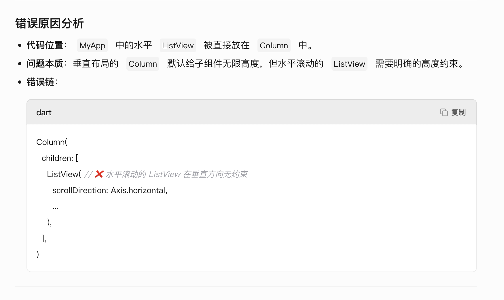
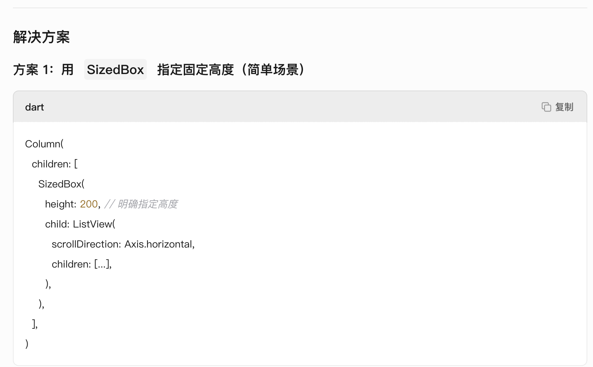
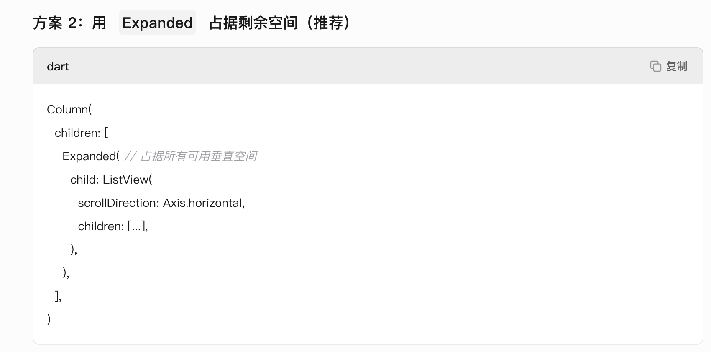
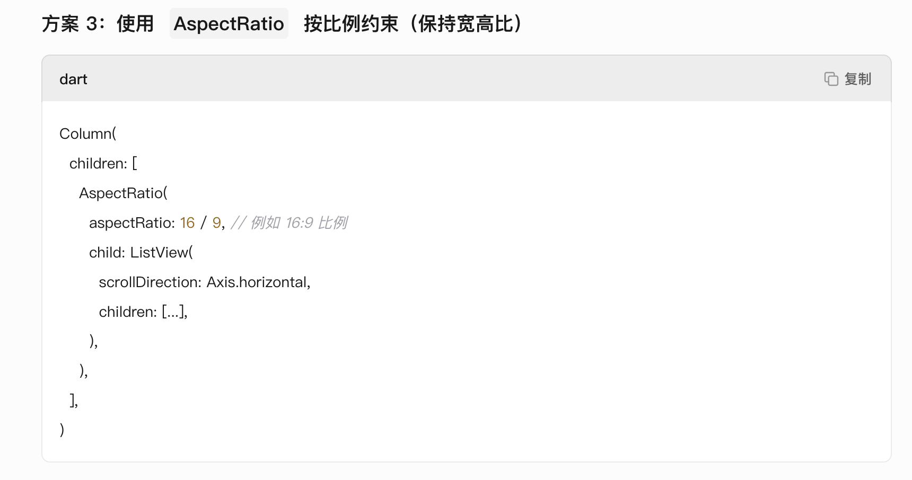

  在 Flutter 中遇到 Horizontal viewport was given unbounded height 错误，是由于 **水平滚动的 ListView 在垂直方向没有高度约束​ ​**。以下是问题分析和解决方案：
  
  
  
  
  ```dart
  class MyApp extends StatelessWidget {
  const MyApp({super.key});

  @override
  Widget build(BuildContext context) {
    return Column(
      children: [
        // 方案 2：使用 Expanded 填充剩余空间
        Expanded(
          child: ListView(
            scrollDirection: Axis.horizontal,
            children: <Widget>[
              Container(width: 160, color: Colors.red),
              Container(width: 160, color: Colors.blue),
              Container(width: 160, color: Colors.green),
              Container(width: 160, color: Colors.yellow),
              Container(width: 160, color: Colors.orange),
            ],
          ),
        ),
      ],
    );
  }
}
  ```