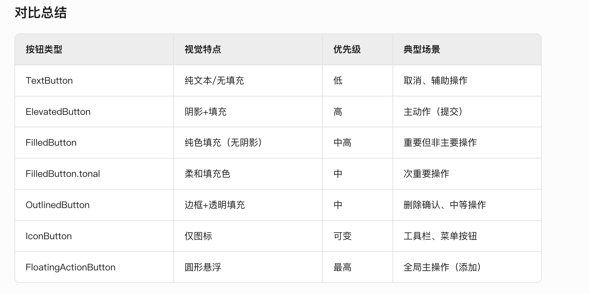

### ​​1. TextButton​​
* **用途​​**： 低优先级操作（如取消、辅助选项）。
* **无填充、无边框**​​，文字/图标为基础色。
* **代码实例：**
```dart
TextButton(
  onPressed: () {},
  child: Text('取消'),
)
```
### ​​2. ElevatedButton
* ​**​用途​​：​​高优先级主操作**​​（如表单提交）。
* **样式​​：​​带阴影的填充按钮​**​，强调立体感。
* **代码实例：**
```dart
ElevatedButton(
  onPressed: () {},
  child: Text('提交'),
)
```
### 3. FilledButton​​
* **​用途​**​：强调重要但非主要操作（Material 3）。
* **样式​​：​​纯色填充​**​，比 ElevatedButton 扁平化。
* **示例**
 
```dart
FilledButton(
  onPressed: () {},
  child: Text('保存草稿'),
)
```
### 4. FilledButton.tonal​​
* ​**用途**​​：次重要操作（用柔和颜色降低视觉权重）。
* **​样式​**​：类似 FilledButton，但使用​**​次要颜色层​​**（如浅蓝色）。
* **​示例​**​：
```dart
FilledButton.tonal(
  onPressed: () {},
  child: Text('更多选项'),
)
```
### ​​5. OutlinedButton​​
* ​**​用途​​：​​中等优先级操作**​​（如删除前确认）。
* ​**​样式​​：​​带边框，无填充​**​，视觉层次在 Text 和 Elevated 之间。
* ​​**示例​**​：
```dart
OutlinedButton(
  onPressed: () {},
  child: Text('删除'),
  style: OutlinedButton.styleFrom(
    side: BorderSide(color: Colors.red),
  ),
)

```
### IconButton​
* **用途​​：​​工具栏、菜单中的图标操作​**​（非文本按钮）。
* **样式​​：​​仅有图标**​​，可自定义尺寸、颜色。
* **示例**：
```dart
IconButton(
  onPressed: () {},
  icon: Icon(Icons.menu),
  tooltip: '菜单',
)
```
### FloatingActionButton (FAB)​
* **用途​​：​​全局主操作**​​（如创建新内容）。
* **样式​​：​​圆形悬浮按钮​**​，固定位置（右下角）。
* 示例
```dart
FloatingActionButton(
  onPressed: () {},
  child: Icon(Icons.add),
  tooltip: '新建',
)
```


### 注意事项​​
**​1.​禁用状态**​​：通过 onPressed: null 设置禁用，按钮会自动灰显。
​**2.​自定义样式​**​：所有按钮均支持 style 参数（如 ButtonStyle）调整颜色、形状。
​​Material 
**3​​：FilledButton** 系列是 Material Design 3 引入，需确保主题兼容。

#### button更改文本颜色
```dart
import 'dart:io';

import 'package:flutter/material.dart';
import 'package:myflutterproject/state_manager.dart';

void main() {
  runApp(const MyApp());
}

class MyApp extends StatefulWidget {
  const MyApp({super.key});

  @override
  State<MyApp> createState() => _MyAppState();
}

class _MyAppState extends State<MyApp> {
  @override
  Widget build(BuildContext context) {
    return MaterialApp(
      title: 'Flutter Demo',
      theme: ThemeData(
        primarySwatch: Colors.blue,
        scaffoldBackgroundColor: Colors.white,
      ),
      home: Scaffold(
        appBar: AppBar(title: const Text('Flutter Demo Home Page')),
        body: StateManager(data: 'Hello, World!', child: MyCounter()),
      ),
    );
  }
}

class MyCounter extends StatelessWidget {
  const MyCounter({super.key});

  @override
  Widget build(BuildContext context) {
    var data = StateManager.of(context)?.data ?? '';

    //8个按钮
    return Container(
      color: Colors.white,
      width: double.infinity,
      child: Column(
        crossAxisAlignment: CrossAxisAlignment.start,
        children: [
          TextButton(
            onPressed: () {},
            style: ButtonStyle(
              backgroundColor: WidgetStateProperty.all(Colors.orange),
            ),
            child: Text('TextButton', style: TextStyle(color: Colors.white)),
          ),
          ElevatedButton(
            onPressed: () {},
            style: ButtonStyle(
              backgroundColor: WidgetStateProperty.all(Colors.red),
              foregroundColor: WidgetStateProperty.all(Colors.white),
            ),
            child: Text('ElevatedButton'),
          ),
          FilledButton(
            onPressed: () {},

            style: ButtonStyle(
              backgroundColor: WidgetStateProperty.all(Colors.black),
              foregroundColor: WidgetStateProperty.all(Colors.white),
            ),
            child: Text('FilledButton'),
          ),
          FilledButton.tonal(
            onPressed: () {},
            style: ButtonStyle(
              backgroundColor: WidgetStateProperty.all(Colors.blue),
              foregroundColor: WidgetStateProperty.all(Colors.white),
            ),
            child: Text('FilledButton.tonal'),
          ),

          OutlinedButton(
            onPressed: () {},

            style: ButtonStyle(
              backgroundColor: WidgetStateProperty.all(Colors.yellow),
              foregroundColor: WidgetStateProperty.all(Colors.white),
            ),
            child: Text('OutlinedButton'),
          ),
          IconButton(
            padding: const EdgeInsets.all(0),
            onPressed: () {},
            icon: Image.asset('web/icons/Icon-192.png', width: 45, height: 45),
          ),
          FloatingActionButton(
            onPressed: () {
              print('FloatingActionButton');
            },
            backgroundColor: Colors.green,
            foregroundColor: Colors.white,
            child: const Icon(Icons.add),
          ),
        ],
      ),
    );
  }
}

```