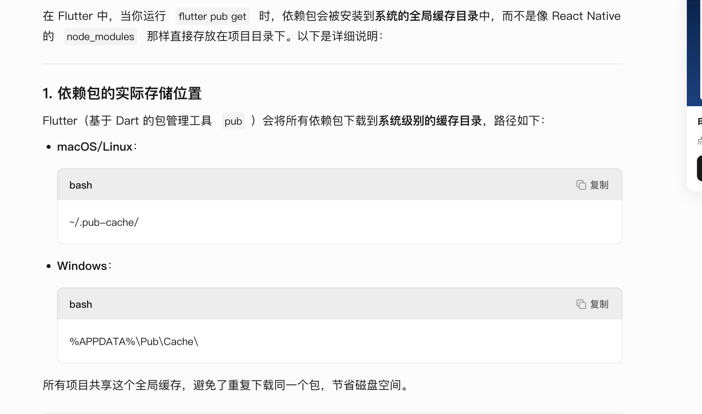
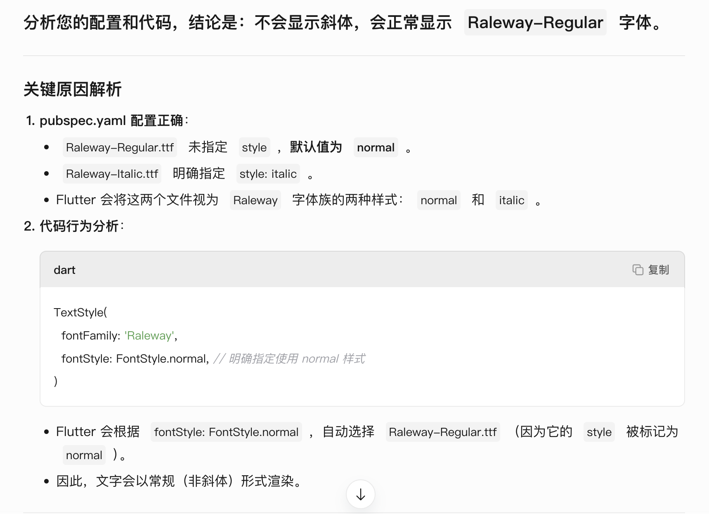
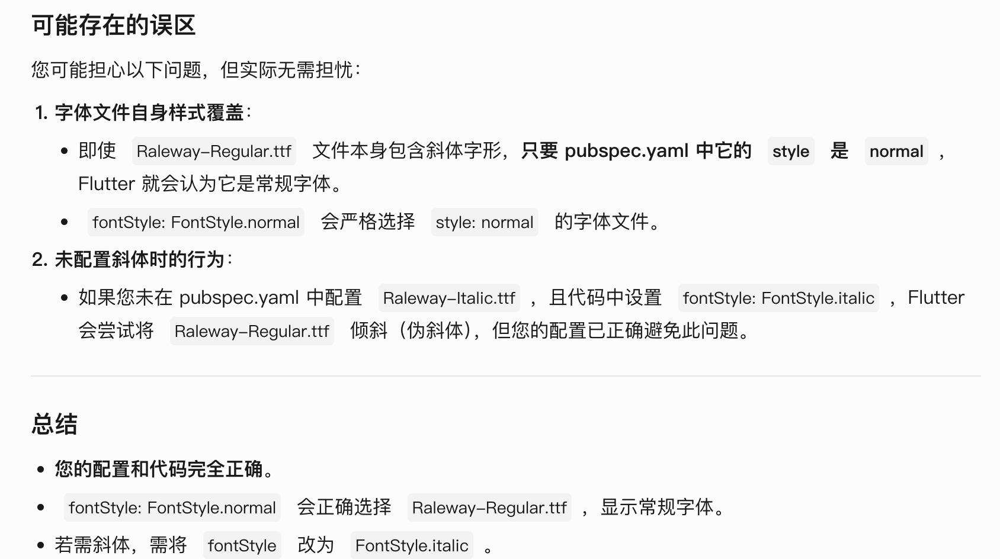

#### flutter pub get 


```dart
fonts:
    - family: Raleway
      fonts:
        - asset: fonts/Raleway-Regular.ttf
        - asset: fonts/Raleway-Italic.ttf
          style: italic
    - family: RobotoMono
      fonts:
        - asset: fonts/RobotoMono-Regular.ttf
        - asset: fonts/RobotoMono-Bold.ttf
          weight: 700
fonts:
    - family: Raleway
      fonts:
        - asset: fonts/Raleway-Regular.ttf
        - asset: fonts/Raleway-Italic.ttf
          style: italic
    - family: RobotoMono
      fonts:
        - asset: fonts/RobotoMono-Regular.ttf
        - asset: fonts/RobotoMono-Bold.ttf
          weight: 700
//如果这样配置 代码这样写 会显示斜体吗
@override
  Widget build(BuildContext context) {
    return Scaffold(
      appBar: AppBar(title: Text(title)),
      body: Column(
        children: [
          Text(
            '我是中国人',
            style: TextStyle(
              fontFamily: 'Raleway',
              fontSize: 20,
              fontStyle: FontStyle.normal,
            ),
          ),
        ],
      ),
    );
  }
```



### 验证场景
如果您的代码改为以下写法，才会显示斜体：
```dart
TextStyle(
  fontFamily: 'Raleway',
  fontStyle: FontStyle.italic, // 指定 italic 样式
)
```
此时 Flutter 会加载 Raleway-Italic.ttf，文字会以真正的斜体字形显示。

#### 可能存在的误区​​
您可能担心以下问题，但实际无需担忧：

​1. **​字体文件自身样式覆盖​​：**
* 即使 Raleway-Regular.ttf 文件本身包含斜体字形，​​只要 pubspec.yaml 中它的 style 是 normal​​，Flutter 就会认为它是常规字体。
* fontStyle: FontStyle.normal 会严格选择 style: normal 的字体文件。
  
​2.**​未配置斜体时的行为​​：**
* 如果您未在 pubspec.yaml 中配置 Raleway-Italic.ttf，且代码中设置 fontStyle: FontStyle.italic，Flutter 会尝试将 Raleway-Regular.ttf 倾斜（伪斜体），但您的配置已正确避免此问题。

