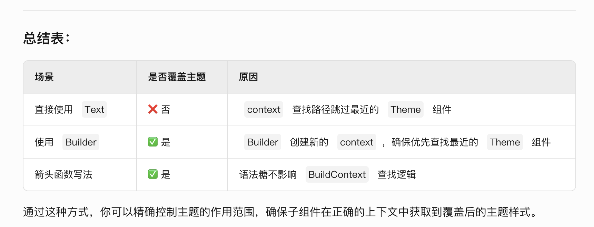

### 创建应用主题
 ```dart
 MaterialApp(
  title: appName,
  theme: ThemeData(
    // Define the default brightness and colors.
    colorScheme: ColorScheme.fromSeed(
      seedColor: Colors.purple,
      // ···
      brightness: Brightness.dark,
    ),

    // Define the default `TextTheme`. Use this to specify the default
    // text styling for headlines, titles, bodies of text, and more.
    textTheme: TextTheme(
      displayLarge: const TextStyle(
        fontSize: 72,
        fontWeight: FontWeight.bold,
      ),
      // ···
      titleLarge: GoogleFonts.oswald(
        fontSize: 30,
        fontStyle: FontStyle.italic,
      ),
      bodyMedium: GoogleFonts.merriweather(),
      displaySmall: GoogleFonts.pacifico(),
    ),
  ),
  home: const MyHomePage(title: appName),
);
 ```

 * **​任何组件都可以通过 Builder 小部件获取其所在位置的上下文（context**​​。Builder 的核心作用是为子组件提供一个独立的 BuildContext，从而在组件树中精确控制上下文的层级。以下是`详细解释`：
 ***

### 1. 为什么需要 Builder？​​
* **​上下文（context）层级问题​​：**
Flutter 的 context 代表组件在树中的位置。直接使用父组件的 context 可能导致无法访问子组件树中的状态或主题。
​**​典型场景​​：**
当需要**局部覆盖主题**​​（如 Theme）、​​访问**子组件的上下文**​​ 或 **​​避免** context **绑定到父组件**​​ 时，必须使用 Builder。
---
### 2. Builder 的工作原理​​

* Builder 是一个无状态组件，通过其 builder 方法创建一个新的 BuildContext。
子组件在 builder 闭包中构建时，会使用 Builder 所在位置的上下文，而非父组件的上下文。
  **示例代码：**
```dart
Widget build(BuildContext context) {
  return Builder(
    builder: (childContext) {
      // 这里的 childContext 是 Builder 所在位置的上下文
      return Text('子组件的上下文: $childContext');
    },
  );
}
```
### ​​3. 哪些场景必须用 Builder？​​
**场景 1：局部覆盖主题（Theme）​**
```dart
  Theme(
            data: ThemeData(
              textTheme: Theme.of(context).textTheme.copyWith(
                titleLarge: const TextStyle(
                  fontSize: 30,
                  fontStyle: FontStyle.italic,
                  color: Colors.red,
                ),
              ),
            ),
            child: Text(
              '测试覆盖主题',
              style: Theme.of(context).textTheme.titleLarge,
            ),
          ),
```

#### ​4. 哪些组件隐式使用了 Builder？​​
许多 Flutter 内置组件（如 ListView.builder、FutureBuilder、StreamBuilder）内部已经通过 Builder 管理上下文，开发者无需手动处理。


#### symmetric
* sɪˈmetrɪk
