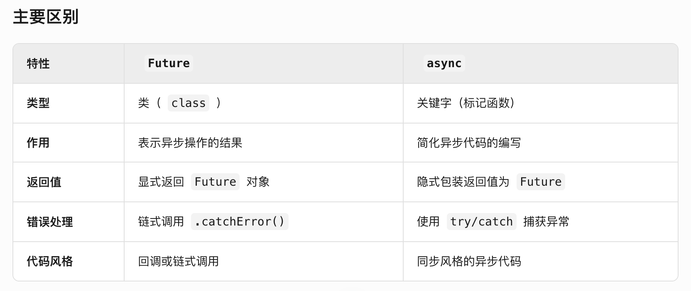
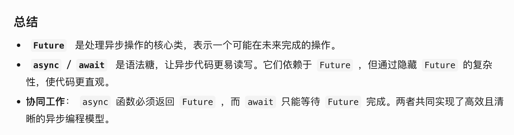

在Flutter中，async和Future是处理异步操作的两个关键概念，但它们的角色和用途不同：
### 1. ​​Future：表示异步操作的结果​

* **定义**​​：Future是一个类（class），代表一个可能在将来完成的操作的结果。它用于处理异步操作（如网络请求、文件读写、定时任务等）。
* **​作用​**​：Future可以处于三种状态：
  -未完成（操作尚未结束）。
  -完成并带有值（操作成功）。
  -完成并带有错误（操作失败）。
* **​使用方式​**​：
```dart
Future<void> loadData() async {
  try {
    var data = await fetchData(); // 等待Future完成
    print(data);
  } catch (e) {
    print("Error: $e");
  }
}
```
**主要区别**


